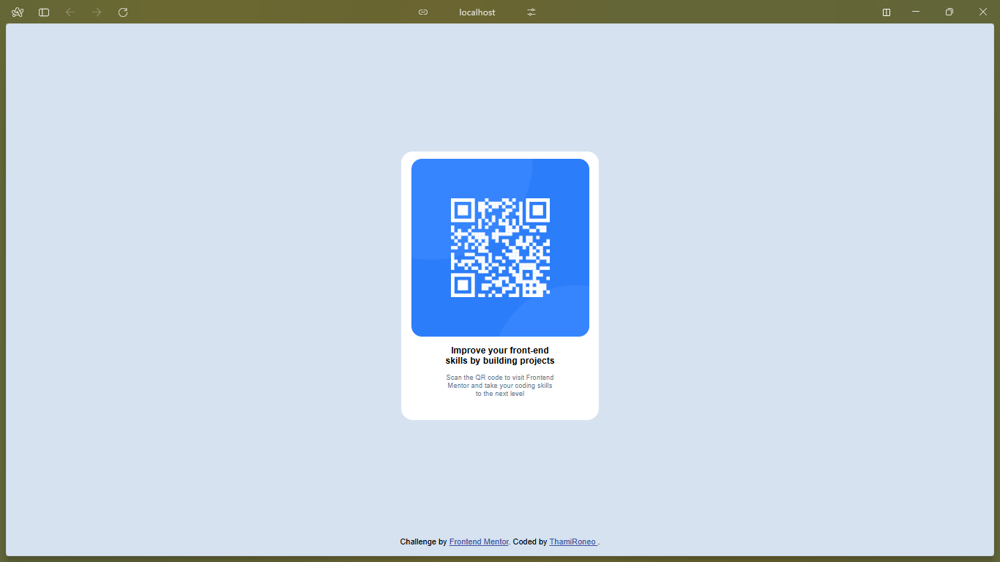

# Frontend Mentor - QR code component solution

This is a solution to the [QR code component challenge on Frontend Mentor](https://www.frontendmentor.io/challenges/qr-code-component-iux_sIO_H). Frontend Mentor challenges helps improve coding skills by building realistic projects. 

## Table of contents

- [Overview](#overview)
  - [Screenshot](#screenshot)
  - [Links](#links)
- [My process](#my-process)
  - [Built with](#built-with)
  - [What I learned](#what-i-learned)
  - [Continued development](#continued-development)
  - [Useful resources](#useful-resources)
- [Author](#author)


## Overview

### Screenshot




### Links

- Solution URL: [Add solution URL here](https://your-solution-url.com)
- Live Site URL: [Add live site URL here](https://your-live-site-url.com)

## My process

### Built with
- Semantic HTML5
- CSS custom properties
- Flexbox

### What I learned

My biggest take-away from this project is that I now can center content horizontally and vertically using Flexbox.

Here are the code snippets, see below:

```html
<body>
    <div class="container-main">
      <div class="qr-container">
        
      </div>
    </div>
</body>
```
```css
body {
  display: flex;
  flex-direction: column;
  justify-content: center;
  align-items: center;
}
```

### Continued development

I want to try and develop the solution to this challenge further using media queries for different screen resolutions. I still need to further explore how to develop a responsive typography.

### Useful resources

- [W3Schools](https://www.w3schools.com/css/css3_flexbox_responsive.asp) - This helped me for creating a responsive layout based on the type of screen size and device. I really liked the media queries pattern and will use it going forward.
- [HubSpot Blog](https://blog.hubspot.com/website/responsive-text) - This is an amazing article which helped me finally understand the difference between viewport width and viewport height, responsive text with breakpoints, and relative versus absolute units. I'd recommend it to anyone still learning this concept.

## Author

- Website - [ThamiRoneo](https://www.github.com/ThamiRoneo)
- Frontend Mentor - [@ThamiRoneo](https://www.frontendmentor.io/profile/ThamiRoneo)
- Twitter - [@Kay_ron1](https://www.twitter.com/kay_ron1)